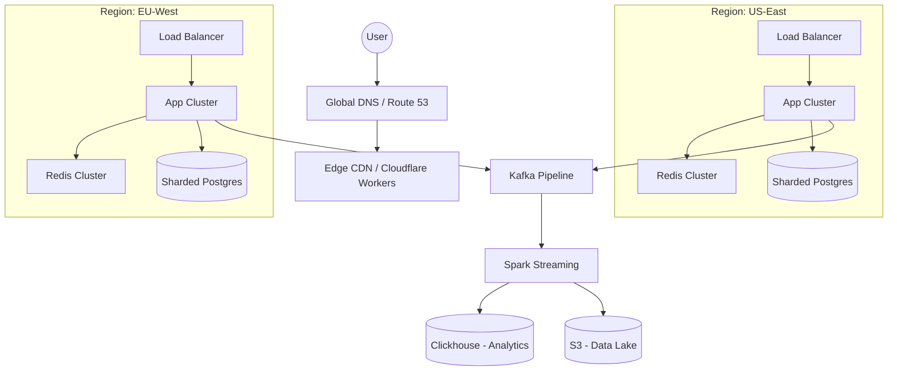

# PART 6A: PRACTICE PROBLEMS - URL & LINK MANAGEMENT SYSTEMS
## Complete Mastery Guide: From Foundations to Interview Excellence

---

# MODULE 6.1: URL & LINK MANAGEMENT - DEEP DIVE

## 🎯 Learning Objectives
After mastering this module, you will:
- Design production-grade URL shortening systems from scratch
- Understand every component: ID generation, encoding, storage, caching, analytics
- Handle scale: billions of URLs, millions of requests/second
- Answer ANY interview question on URL shorteners, Pastebin, QR generators
- Implement real systems with code examples

---

## 📚 SECTION 1: FOUNDATIONAL BUILDING BLOCKS

### 1.1 ID Generation Strategies - The Core Problem

**Problem Statement**: Generate unique, short, URL-safe identifiers at massive scale

#### **Strategy 1: Auto-Increment Database IDs**
```
Concept: Use database's native auto-increment feature
```

**How It Works:**
```sql
-- PostgreSQL example
CREATE TABLE urls (
  id BIGSERIAL PRIMARY KEY,  -- Auto-incrementing: 1, 2, 3...
  long_url TEXT NOT NULL,
  created_at TIMESTAMP DEFAULT NOW()
);

INSERT INTO urls (long_url) VALUES ('https://example.com/very/long/url');
-- Returns id: 1000000
-- Convert to Base62: "4c92"
-- Short URL: https://tiny.url/4c92
```

**Pros:**
- Simple implementation
- Guaranteed uniqueness
- Predictable, sequential

**Cons:**
- ❌ **Single point of failure** (one database)
- ❌ **Scalability bottleneck** (writes limited to one master)
- ❌ **Security issue**: Sequential IDs are predictable (users can guess next URL)
- ❌ **Difficult to shard**: Coordination needed across databases

**When to Use:** Small-scale systems, MVPs, non-distributed setups

---

#### **Strategy 2: Hash-Based ID Generation**

**How It Works:**
```javascript
// Node.js example
const crypto = require('crypto');

function generateShortURL(longURL) {
  // Hash the long URL
  const hash = crypto.createHash('md5')
    .update(longURL)
    .digest('hex'); // Produces: "5d41402abc4b2a76b9719d911017c592"
  
  // Take first 7 characters
  return hash.substring(0, 7); // "5d41402"
}

// Usage
const shortID = generateShortURL("https://example.com/page");
console.log(shortID); // "5d41402"
```

**Collision Handling:**
```javascript
async function generateUniqueShortURL(longURL, database) {
  let shortID = hashFunction(longURL).substring(0, 7);
  let attempts = 0;
  
  // Check if ID exists
  while (await database.exists(shortID)) {
    // Collision detected! Append counter
    shortID = hashFunction(longURL + attempts).substring(0, 7);
    attempts++;
    
    if (attempts > 5) {
      // Increase length if too many collisions
      shortID = hashFunction(longURL + attempts).substring(0, 8);
    }
  }
  
  return shortID;
}
```

**Pros:**
- ✅ Same long URL always produces same short URL (idempotent)
- ✅ No database read needed to generate ID
- ✅ Distributed-friendly (no coordination)

**Cons:**
- ❌ **Collision probability** increases with scale
- ❌ **Collision handling** adds complexity and latency
- ❌ Fixed length = limited namespace (7 chars Base62 = 3.5 trillion combinations)

**Collision Math:**
```
Birthday Paradox applies:
- 7-character Base62: 62^7 = 3.5 trillion IDs
- At 1 billion URLs: ~0.014% collision probability
- At 10 billion URLs: ~1.4% collision probability

Formula: P(collision) ≈ n²/(2*N)
where n = number of URLs, N = total possible IDs
```

---

#### **Strategy 3: Random ID Generation**

**How It Works:**
```python
import random
import string

def generate_random_id(length=7):
    # Character set: a-zA-Z0-9 (62 characters)
    chars = string.ascii_letters + string.digits
    return ''.join(random.choices(chars, k=length))

# Generate IDs
print(generate_random_id())  # "aB3xK9p"
print(generate_random_id())  # "Zm4qR8L"
```

**With Collision Check:**
```python
async def generate_unique_random_id(db, length=7, max_attempts=5):
    for attempt in range(max_attempts):
        short_id = generate_random_id(length)
        
        # Check database for uniqueness
        if not await db.exists(short_id):
            return short_id
    
    # If failed, increase length
    return generate_random_id(length + 1)
```

**Pros:**
- ✅ Non-sequential (secure - can't guess next ID)
- ✅ Simple logic
- ✅ Distributed-friendly

**Cons:**
- ❌ **Collision probability** (same as hashing)
- ❌ **Database check required** for uniqueness (extra latency)
- ❌ **Multiple attempts** may be needed

**Optimization: Bloom Filters**
```python
class IDGenerator:
    def __init__(self):
        # Bloom filter: probabilistic data structure
        # Fast check if ID "might exist" (no false negatives)
        self.bloom_filter = BloomFilter(capacity=10_000_000_000, error_rate=0.001)
    
    async def generate(self):
        while True:
            id = random_id()
            
            # Fast bloom filter check (in-memory, microseconds)
            if not self.bloom_filter.might_contain(id):
                # Confirm with database (rare)
                if not await db.exists(id):
                    self.bloom_filter.add(id)
                    return id
```

---

#### **Strategy 4: Snowflake-Style Distributed ID Generation** ⭐ **PRODUCTION CHOICE**

**Concept:** Generate IDs with embedded metadata using bit manipulation

**Structure (64 bits):**
```
|-- 1 bit --|-- 41 bits --|-- 10 bits --|-- 12 bits --|
| Sign (0)  |  Timestamp  |  Machine ID | Sequence    |

Breakdown:
- 1 bit: Always 0 (reserved for sign)
- 41 bits: Milliseconds since epoch (69 years capacity)
- 10 bits: Machine/datacenter ID (1024 machines)
- 12 bits: Sequence number (4096 IDs per millisecond per machine)
```

**Capacity:**
- **4,096,000 IDs per second per machine**
- **1024 machines = 4+ billion IDs/second globally**

**Implementation:**
```javascript
class SnowflakeIDGenerator {
  constructor(machineId) {
    this.machineId = machineId; // 0-1023
    this.sequence = 0;
    this.lastTimestamp = -1;
    this.epoch = 1609459200000; // Jan 1, 2021 UTC
  }
  
  generate() {
    let timestamp = Date.now();
    
    // If same millisecond, increment sequence
    if (timestamp === this.lastTimestamp) {
      this.sequence = (this.sequence + 1) & 4095; // Max 4095
      
      // Sequence overflow - wait for next millisecond
      if (this.sequence === 0) {
        timestamp = this.waitNextMillis(timestamp);
      }
    } else {
      this.sequence = 0; // Reset sequence
    }
    
    this.lastTimestamp = timestamp;
    
    // Build 64-bit ID
    const id = 
      ((timestamp - this.epoch) << 22) |  // 41 bits timestamp
      (this.machineId << 12) |            // 10 bits machine
      this.sequence;                       // 12 bits sequence
    
    return id;
  }
  
  waitNextMillis(currentTimestamp) {
    while (Date.now() === currentTimestamp) {
      // Busy wait (typically < 1ms)
    }
    return Date.now();
  }
}

// Usage
const generator = new SnowflakeIDGenerator(42); // Machine ID = 42
console.log(generator.generate()); // 1234567890123456789
```

**Pros:**
- ✅ **Globally unique** without coordination
- ✅ **Sortable by time** (useful for analytics)
- ✅ **No database lookup** needed
- ✅ **4+ billion IDs/sec** capacity
- ✅ **Contains metadata** (timestamp, machine)

**Cons:**
- ❌ Requires machine ID coordination (Zookeeper, config)
- ❌ Clock synchronization needed (NTP)
- ❌ Longer IDs (64-bit number = 11 chars Base62 vs 7 chars)

**Base62 Encoding:**
```javascript
function toBase62(num) {
  const chars = '0123456789abcdefghijklmnopqrstuvwxyzABCDEFGHIJKLMNOPQRSTUVWXYZ';
  let result = '';
  
  while (num > 0) {
    result = chars[num % 62] + result;
    num = Math.floor(num / 62);
  }
  
  return result || '0';
}

const id = 1234567890123456789n; // BigInt
console.log(toBase62(id)); // "1ly7vk0B9X" (10 chars)
```

---

#### **Strategy 5: Range-Based ID Allocation (Ticket Server)**

**How It Works:**
```
Ticket Server (Zookeeper or Redis):
- Pre-allocates ranges of IDs to each server
- Server 1 gets: 1,000,000 - 1,099,999 (100K IDs)
- Server 2 gets: 1,100,000 - 1,199,999 (100K IDs)
- Each server increments locally without coordination
```

**Implementation:**
```python
# Redis-based ticket server
class TicketServer:
    def allocate_range(self, server_id, range_size=100000):
        # Atomic increment in Redis
        start = redis.incr('id_counter', range_size)
        end = start + range_size - 1
        
        return {
            'server_id': server_id,
            'start': start,
            'end': end
        }

# Application server
class IDGenerator:
    def __init__(self, server_id):
        self.current = None
        self.end = None
        self.server_id = server_id
    
    def generate(self):
        # Need new range?
        if self.current is None or self.current > self.end:
            range_data = ticket_server.allocate_range(self.server_id)
            self.current = range_data['start']
            self.end = range_data['end']
        
        id = self.current
        self.current += 1
        return id
```

**Pros:**
- ✅ **No collisions** (ranges never overlap)
- ✅ **Minimal coordination** (only when range exhausted)
- ✅ **High throughput** (local increments)

**Cons:**
- ❌ Gaps in ID space if server crashes
- ❌ Ticket server = potential bottleneck
- ❌ Sequential within ranges (mild predictability)

---

### 1.2 Base62 Encoding - Making IDs URL-Safe

**Why Base62?**
```
URL-safe characters only:
- Digits: 0-9 (10 characters)
- Lowercase: a-z (26 characters)
- Uppercase: A-Z (26 characters)
Total: 62 characters

Base64 uses +, / which require URL encoding (%2B, %2F)
Base62 avoids this problem
```

**Encoding Algorithm:**
```python
def encode_base62(num):
    """Convert integer to Base62 string"""
    chars = "0123456789abcdefghijklmnopqrstuvwxyzABCDEFGHIJKLMNOPQRSTUVWXYZ"
    
    if num == 0:
        return chars[0]
    
    result = []
    while num > 0:
        remainder = num % 62
        result.append(chars[remainder])
        num = num // 62
    
    return ''.join(reversed(result))

# Examples
print(encode_base62(1000000))  # "4c92"
print(encode_base62(1))         # "1"
print(encode_base62(61))        # "Z"
print(encode_base62(62))        # "10"
```

**Decoding Algorithm:**
```python
def decode_base62(encoded):
    """Convert Base62 string to integer"""
    chars = "0123456789abcdefghijklmnopqrstuvwxyzABCDEFGHIJKLMNOPQRSTUVWXYZ"
    char_to_index = {c: i for i, c in enumerate(chars)}
    
    num = 0
    for char in encoded:
        num = num * 62 + char_to_index[char]
    
    return num

# Verify
encoded = encode_base62(1000000)  # "4c92"
decoded = decode_base62(encoded)  # 1000000
assert decoded == 1000000
```

**Length Calculation:**
```
Formula: length = ceil(log62(max_number))

Examples:
- 1 million URLs: ceil(log62(10^6)) = 4 characters
- 1 billion URLs: ceil(log62(10^9)) = 6 characters
- 1 trillion URLs: ceil(log62(10^12)) = 7 characters

62^7 = 3,521,614,606,208 (3.5 trillion combinations)
```

---

### 1.3 Database Design Patterns

#### **Schema Design for URL Shortener:**

```sql
-- PostgreSQL schema
CREATE TABLE urls (
  id BIGSERIAL PRIMARY KEY,
  short_code VARCHAR(10) UNIQUE NOT NULL,  -- Base62 encoded ID
  long_url TEXT NOT NULL,
  user_id BIGINT REFERENCES users(id),
  created_at TIMESTAMP DEFAULT NOW(),
  expires_at TIMESTAMP,
  is_active BOOLEAN DEFAULT TRUE,
  
  -- Indexes for performance
  INDEX idx_short_code (short_code),  -- Redirect lookups
  INDEX idx_user_created (user_id, created_at DESC),  -- User's URLs
  INDEX idx_expiry (expires_at) WHERE expires_at IS NOT NULL  -- Cleanup
);

-- Click tracking (separate table for scale)
CREATE TABLE clicks (
  id BIGSERIAL PRIMARY KEY,
  url_id BIGINT REFERENCES urls(id),
  clicked_at TIMESTAMP DEFAULT NOW(),
  ip_address INET,
  user_agent TEXT,
  referer TEXT,
  country_code CHAR(2),
  
  -- Partitioned by month for performance
  PARTITION BY RANGE (clicked_at)
);

-- Monthly partitions
CREATE TABLE clicks_2024_01 PARTITION OF clicks
  FOR VALUES FROM ('2024-01-01') TO ('2024-02-01');
```

**Why This Design:**
- `short_code` unique index → O(1) lookups for redirects
- `user_id + created_at` index → Efficient "my URLs" queries
- Separate `clicks` table → Unbounded growth doesn't bloat `urls` table
- Partitioning → Old click data can be archived/dropped

---

#### **NoSQL Option (Cassandra):**

```cql
-- Optimized for read-heavy redirect workload
CREATE TABLE urls_by_short_code (
  short_code TEXT PRIMARY KEY,
  long_url TEXT,
  user_id UUID,
  created_at TIMESTAMP,
  expires_at TIMESTAMP,
  click_count COUNTER  -- Cassandra counter type
);

-- User's URLs (different partition key for access pattern)
CREATE TABLE urls_by_user (
  user_id UUID,
  created_at TIMESTAMP,
  short_code TEXT,
  long_url TEXT,
  PRIMARY KEY (user_id, created_at, short_code)
) WITH CLUSTERING ORDER BY (created_at DESC);

-- Analytics (time-series optimized)
CREATE TABLE clicks_by_url (
  short_code TEXT,
  hour TIMESTAMP,  -- Truncated to hour
  country_code TEXT,
  click_count COUNTER,
  PRIMARY KEY (short_code, hour, country_code)
);
```

**Access Patterns:**
```cql
-- Redirect (primary use case) - Single partition read
SELECT long_url FROM urls_by_short_code 
WHERE short_code = 'abc123';

-- User's URLs - Efficient range query
SELECT * FROM urls_by_user 
WHERE user_id = ? 
ORDER BY created_at DESC 
LIMIT 20;

-- Analytics - Time-range aggregation
SELECT SUM(click_count) FROM clicks_by_url
WHERE short_code = 'abc123' 
  AND hour >= '2024-01-01' 
  AND hour < '2024-02-01';
```

---

### 1.4 Caching Strategies

**Why Cache?**
```
Problem: 80/20 rule
- 20% of URLs receive 80% of traffic
- Example: Popular news article shared on social media
  gets 1M clicks in 1 hour
- Database can't handle 278 queries/second for one URL

Solution: Cache hot URLs in Redis/Memcached
- Redis can handle 100K+ ops/sec on single instance
- Sub-millisecond latency vs database's 10-50ms
```

#### **Cache-Aside Pattern (Lazy Loading):**

```javascript
async function getRedirectURL(shortCode) {
  // 1. Check cache first
  let longURL = await redis.get(`url:${shortCode}`);
  
  if (longURL) {
    // Cache hit! (90%+ of requests)
    await redis.incr(`clicks:${shortCode}`); // Async click tracking
    return longURL;
  }
  
  // 2. Cache miss - query database
  const result = await db.query(
    'SELECT long_url FROM urls WHERE short_code = $1',
    [shortCode]
  );
  
  if (!result) {
    return null; // URL not found
  }
  
  longURL = result.long_url;
  
  // 3. Store in cache for future requests
  await redis.setex(
    `url:${shortCode}`,
    3600, // 1 hour TTL
    longURL
  );
  
  // 4. Track click
  await logClick(shortCode);
  
  return longURL;
}
```

**Pros:**
- ✅ Only caches accessed URLs (efficient memory use)
- ✅ Cache miss doesn't break system (database fallback)

**Cons:**
- ❌ First request always hits database (cold start)
- ❌ Cache stampede risk (covered next)

---

#### **Cache Stampede Problem & Solution:**

**Problem:**
```
Scenario: Popular URL's cache entry expires
1. 1000 concurrent requests arrive
2. All find cache empty (stampede!)
3. All query database simultaneously
4. Database overwhelmed (1000 queries for same data)
```

**Solution 1: Mutex/Lock**
```javascript
const locks = new Map(); // In-memory lock registry

async function getRedirectURLWithLock(shortCode) {
  let longURL = await redis.get(`url:${shortCode}`);
  
  if (longURL) return longURL;
  
  // Check if another request is already fetching
  if (locks.has(shortCode)) {
    // Wait for the other request to finish
    await locks.get(shortCode);
    // Try cache again (should be populated now)
    return await redis.get(`url:${shortCode}`);
  }
  
  // Acquire lock
  const lockPromise = new Promise(async (resolve) => {
    longURL = await db.query(/*...*/);
    await redis.setex(`url:${shortCode}`, 3600, longURL);
    locks.delete(shortCode);
    resolve(longURL);
  });
  
  locks.set(shortCode, lockPromise);
  return await lockPromise;
}
```

**Solution 2: Probabilistic Early Expiration**
```python
import random
import time

def get_with_early_expiration(short_code, ttl=3600):
    cached = redis.get(f"url:{short_code}")
    
    if cached:
        # Get TTL remaining
        ttl_remaining = redis.ttl(f"url:{short_code}")
        
        # Probabilistic refresh: higher chance as expiry approaches
        # When 10% TTL remains, 10% chance to refresh
        refresh_probability = 1 - (ttl_remaining / ttl)
        
        if random.random() < refresh_probability:
            # Asynchronously refresh cache (don't wait)
            asyncio.create_task(refresh_cache(short_code))
        
        return cached
    
    # Cache miss - normal flow
    return fetch_and_cache(short_code)
```

---

#### **Write-Through Cache (for analytics):**

```javascript
async function createShortURL(longURL, userId) {
  // 1. Generate ID
  const id = snowflakeGenerator.generate();
  const shortCode = toBase62(id);
  
  // 2. Write to database
  await db.query(`
    INSERT INTO urls (id, short_code, long_url, user_id)
    VALUES ($1, $2, $3, $4)
  `, [id, shortCode, longURL, userId]);
  
  // 3. Immediately write to cache (write-through)
  await redis.setex(
    `url:${shortCode}`,
    86400, // 24 hours
    longURL
  );
  
  return shortCode;
}
```

**Benefit:** First redirect doesn't hit database (no cold start)

---

### 1.5 Rate Limiting - Preventing Abuse

**Token Bucket Algorithm:**
```python
class RateLimiter:
    def __init__(self, max_tokens, refill_rate):
        """
        max_tokens: Bucket capacity (e.g., 100 requests)
        refill_rate: Tokens added per second (e.g., 10/sec)
        """
        self.max_tokens = max_tokens
        self.refill_rate = refill_rate
        self.tokens = max_tokens
        self.last_refill = time.time()
    
    def allow_request(self, user_id):
        # Refill tokens based on time elapsed
        now = time.time()
        elapsed = now - self.last_refill
        self.tokens = min(
            self.max_tokens,
            self.tokens + (elapsed * self.refill_rate)
        )
        self.last_refill = now
        
        # Check if request allowed
        if self.tokens >= 1:
            self.tokens -= 1
            return True
        
        return False  # Rate limit exceeded
```

**Redis Implementation (Distributed):**
```lua
-- Lua script executed atomically in Redis
local key = KEYS[1]  -- "rate_limit:user:123"
local max_tokens = tonumber(ARGV[1])
local refill_rate = tonumber(ARGV[2])
local now = tonumber(ARGV[3])

local state = redis.call('HMGET', key, 'tokens', 'last_refill')
local tokens = tonumber(state[1]) or max_tokens
local last_refill = tonumber(state[2]) or now

-- Refill tokens
local elapsed = now - last_refill
tokens = math.min(max_tokens, tokens + (elapsed * refill_rate))

-- Check if allowed
if tokens >= 1 then
  tokens = tokens - 1
  redis.call('HMSET', key, 'tokens', tokens, 'last_refill', now)
  redis.call('EXPIRE', key, 3600)
  return 1  -- Allowed
else
  return 0  -- Rate limited
end
```

**Usage:**
```javascript
app.post('/shorten', async (req, res) => {
  const userId = req.user.id;
  
  // Check rate limit (100 requests, refill 10/sec)
  const allowed = await redis.eval(
    rateLimitScript,
    1,
    `rate_limit:user:${userId}`,
    100,    // max_tokens
    10,     // refill_rate
    Date.now() / 1000
  );
  
  if (!allowed) {
    return res.status(429).json({
      error: 'Rate limit exceeded. Try again in 10 seconds.'
    });
  }
  
  // Process request...
});
```

---

## 🏗️ SECTION 2: PROBLEM 1 - URL SHORTENER (TinyURL)

### **Complete System Design - 3 Iterations**

---

### **ITERATION 1: BASIC VERSION (1K users, 10K URLs/day)**

**Requirements:**
- Create short URLs from long URLs
- Redirect short URLs to original
- No authentication
- 1-week retention

**Architecture:**
```
┌─────────┐      ┌─────────────┐      ┌──────────┐
│ Browser │─────>│  Web Server │─────>│ Database │
│         │<─────│  (Node.js)  │<─────│(Postgres)│
└─────────┘      └─────────────┘      └──────────┘
```

**Database Schema:**
```sql
CREATE TABLE urls (
  id SERIAL PRIMARY KEY,
  short_code CHAR(7) UNIQUE NOT NULL,
  long_url TEXT NOT NULL,
  created_at TIMESTAMP DEFAULT NOW()
);

CREATE INDEX idx_short_code ON urls(short_code);
```

**API Implementation:**
```javascript
const express = require('express');
const { Pool } = require('pg');

const app = express();
const db = new Pool({ /* config */ });

// Base62 encoding
function toBase62(num) {
  const chars = '0123456789abcdefghijklmnopqrstuvwxyzABCDEFGHIJKLMNOPQRSTUVWXYZ';
  let result = '';
  while (num > 0) {
    result = chars[num % 62] + result;
    num = Math.floor(num / 62);
  }
  return result || '0';
}

// POST /shorten - Create short URL
app.post('/shorten', async (req, res) => {
  const { longUrl } = req.body;
  
  // Insert and get auto-increment ID
  const result = await db.query(
    'INSERT INTO urls (long_url, short_code) VALUES ($1, $2) RETURNING id',
    [longUrl, ''] // Temporary empty short_code
  );
  
  const id = result.rows[0].id;
  const shortCode = toBase62(id);
  
  // Update with generated short code
  await db.query(
    'UPDATE urls SET short_code = $1 WHERE id = $2',
    [shortCode, id]
  );
  
  res.json({ shortUrl: `https://tiny.url/${shortCode}` });
});

// GET /:shortCode - Redirect
app.get('/:shortCode', async (req, res) => {
  const { shortCode } = req.params;
  
  const result = await db.query(
    'SELECT long_url FROM urls WHERE short_code = $1',
    [shortCode]
  );
  
  if (result.rows.length === 0) {
    return res.status(404).send('URL not found');
  }
  
  res.redirect(301, result.rows[0].long_url);
});

app.listen(3000);
```

**Limitations:**
- ❌ Single server (no redundancy)
- ❌ Database bottleneck (100-1000 req/s max)
- ❌ No caching (every redirect hits DB)
- ❌ No analytics
- ❌ Sequential IDs (security issue)

---

### **ITERATION 2: SCALED VERSION (1M users, 10M URLs/day)**

**New Requirements:**
- Handle 100K requests/second (redirects)
- User accounts and custom aliases
- Click analytics
- 99.9% availability

**Architecture:**
```
                      ┌──────────────┐
                      │ Load Balancer│
                      │   (Nginx)    │
                      └──────┬───────┘
                             │
            ┌────────────────┼────────────────┐
            │                │                │
      ┌─────▼─────┐   ┌─────▼─────┐   ┌─────▼─────┐
      │  Web       │   │  Web       │   │  Web      │
      │  Server 1  │   │  Server 2  │   │  Server 3 │
      └─────┬──────┘   └─────┬──────┘   └─────┬─────┘
            │                │                │
            └────────────────┼────────────────┘
                             │
                    ┌────────▼─────────┐
                    │  Redis Cluster   │
                    │   (Cache Layer)  │
                    └────────┬─────────┘
                             │
                    ┌────────▼─────────┐
                    │ PostgreSQL       │
                    │ Primary + Replica│
                    └──────────────────┘
```

**Enhanced Schema:**
```sql
CREATE TABLE users (
  id BIGSERIAL PRIMARY KEY,
  email VARCHAR(255) UNIQUE NOT NULL,
  api_key VARCHAR(64) UNIQUE NOT NULL,
  created_at TIMESTAMP DEFAULT NOW()
);

CREATE TABLE urls (
  id BIGINT PRIMARY KEY, -- Snowflake ID
  short_code VARCHAR(10) UNIQUE NOT NULL,
  long_url TEXT NOT NULL,
  user_id BIGINT REFERENCES users(id),
  custom_alias VARCHAR(50),
  created_at TIMESTAMP DEFAULT NOW(),
  expires_at TIMESTAMP,
  
  INDEX idx_short_code (short_code),
  INDEX idx_user_created (user_id, created_at DESC)
);

-- Separate table for analytics (write-heavy)
CREATE TABLE clicks (
  id BIGSERIAL PRIMARY KEY,
  url_id BIGINT REFERENCES urls(id),
  clicked_at TIMESTAMP DEFAULT NOW(),
  ip_address INET,
  user_agent TEXT,
  referer TEXT,
  country_code CHAR(2)
) PARTITION BY RANGE (clicked_at);
```

**Snowflake ID Generator:**
```javascript
class SnowflakeID {
  constructor(machineId) {
    this.machineId = machineId & 0x3FF; // 10 bits
    this.sequence = 0;
    this.lastTimestamp = -1;
    this.epoch = 1609459200000; // 2021-01-01
  }
  
  generate() {
    let timestamp = Date.now();
    
    if (timestamp === this.lastTimestamp) {
      this.sequence = (this.sequence + 1) & 0xFFF;
      if (this.sequence === 0) {
        while (Date.now() === timestamp) {}
        timestamp = Date.now();
      }
    } else {
      this.sequence = 0;
    }
    
    this.lastTimestamp = timestamp;
    
    return (
      (BigInt(timestamp - this.epoch) << 22n) |
      (BigInt(this.machineId) << 12n) |
      BigInt(this.sequence)
    );
  }
}
```

**Service Layer (Iteration 2):**
```javascript
const redis = require('redis');
const client = redis.createClient();

class URLService {
  constructor(db, idGenerator) {
    this.db = db;
    this.idGenerator = idGenerator;
  }

  async createShortURL(longUrl, userId, customAlias = null) {
    let shortCode;
    
    if (customAlias) {
      // 1. Check if alias exists
      const exists = await this.db.query('SELECT 1 FROM urls WHERE short_code = $1', [customAlias]);
      if (exists.rows.length > 0) throw new Error('Alias already taken');
      shortCode = customAlias;
    } else {
      // 2. Generate Snowflake ID and encode to Base62
      const id = this.idGenerator.generate();
      shortCode = toBase62(id);
    }

    // 3. Save to DB
    await this.db.query(
      'INSERT INTO urls (short_code, long_url, user_id) VALUES ($1, $2, $3)',
      [shortCode, longUrl, userId]
    );

    // 4. Pre-populate cache (Write-through)
    await client.setEx(`url:${shortCode}`, 3600 * 24, longUrl);

    return shortCode;
  }

  async getLongURL(shortCode) {
    // 1. Try Cache
    const cached = await client.get(`url:${shortCode}`);
    if (cached) {
      this.logClickAsync(shortCode); // Fire and forget analytics
      return cached;
    }

    // 2. Database Fallback
    const result = await this.db.query(
      'SELECT long_url FROM urls WHERE short_code = $1',
      [shortCode]
    );

    if (result.rows.length === 0) return null;

    const longUrl = result.rows[0].long_url;

    // 3. Backfill Cache
    await client.setEx(`url:${shortCode}`, 3600, longUrl);
    
    this.logClickAsync(shortCode);
    return longUrl;
  }

  async logClickAsync(shortCode) {
    // Push to a queue (like Redis List or Kafka) to avoid blocking the redirect
    await client.lPush('click_logs', JSON.stringify({
      shortCode,
      timestamp: new Date(),
    }));
  }
}
```

**Analytics Worker (Iteration 2):**
```javascript
// Background process consuming the 'click_logs' queue
async function analyticsWorker() {
  while (true) {
    const log = await client.rPop('click_logs');
    if (log) {
      const { shortCode, timestamp } = JSON.parse(log);
      await db.query(
        'INSERT INTO clicks (url_id, clicked_at) SELECT id, $2 FROM urls WHERE short_code = $1',
        [shortCode, timestamp]
      );
    } else {
      await sleep(1000); // Wait for logs
    }
  }
}
```

**Why this is better:**
- ✅ **Decoupled Writes**: Analytics don't slow down the user's redirect.
- ✅ **High Availability**: Redis absorbs 90%+ of the read load.
- ✅ **Custom Aliases**: Supported via explicit check.
- ✅ **No sequential IDs**: Snowflake + Base62 provides obfuscation.

---

### **ITERATION 3: OPTIMIZED / GLOBAL SCALE (1B+ Users, Global Traffic)**

**Requirements:**
- Multi-region support (Low latency globally)
- Billions of URLs (Petabytes of data)
- Real-time global analytics dashboard
- Extreme protection against DDoS and scraping

**Architecture Diagram:**


**Key Optimizations for Global Scale:**

#### **1. Edge Redirects (CDN)**
For extremely popular URLs (viral links), we don't even hit our load balancer.
- **Cloudflare Workers**: Store shortCode -> longUrl mapping in **KV Store** at the edge.
- **Latency**: Reduced from 100ms+ to <10ms.

#### **2. Database Sharding (Geo-based)**
- **Sharding Key**: `user_id` or `short_code`.
- **Strategy**: Range-based or Hash-based sharding across multiple physical database instances.
- **Example**: Codes starting with 'A-M' in Server 1, 'N-Z' in Server 2.

#### **3. Bloom Filters for Non-Existent URLs**
Prevent **Cache Penetration** (Attacker requests millions of bogus short codes to hit the DB).
```python
# In-memory check before hitting Redis/DB
if not bloom_filter.contains(short_code):
    return 404 # Instant rejection
```

#### **4. Modern Analytics Pipeline**
- **Ingestion**: Kafka (handles millions of events/sec).
- **Processing**: Apache Flink/Spark for real-time windowing (clicks per minute).
- **Storage**: **Clickhouse** or **Druid** (OLAP databases) for sub-second dashboard queries.

---

## 🏗️ SECTION 3: PROBLEM 2 - PASTEBIN (Text Storage Service)

### **1. Requirements & Constraints**

**Functional:**
- Users can paste text and get a unique URL.
- Support for syntax highlighting (metadata).
- Anonymous "pastes" allowed.
- Custom expiration (10 min, 1 hour, never).

**Traffic Estimates:**
- 1M pastes/day.
- Read:Write ratio = 10:1.
- Total storage (10 years): 1M * 365 * 10 * 10KB (avg) ≈ **36.5 Terabytes**.

---

### **2. Storage Strategy: Metadata vs. Content**

We should **not** store large text blobs in a relational database.

| Component | Storage Type | Examples |
| :--- | :--- | :--- |
| **Metadata** | NoSQL / Document | MongoDB, DynamoDB (Paste ID, User, Expiry, Syntax) |
| **Content** | Object Storage | AWS S3, Google Cloud Storage, MinIO |
| **Cache** | Key-Value | Redis (Hot pastes) |

---

### **3. Database Schema (NoSQL - DynamoDB)**
```json
{
  "paste_id": "p7x9k2",
  "user_id": "u123",
  "title": "Config Script",
  "syntax": "bash",
  "s3_url": "s3://my-bin/p7x9k2.txt",
  "created_at": "1673731200",
  "expires_at": "1673817600",
  "is_private": false
}
```

---

### **4. System APIs**

- `addPaste(api_dev_key, paste_data, custom_url=None, user_name=None, syntax=None, expiry_date=None)`
- `getPaste(api_dev_key, paste_url_key)`
- `deletePaste(api_dev_key, paste_url_key)`

---

### **5. Handling Expiration (Cleanup)**

We don't want to scan the whole DB to delete old pastes.
1. **Lazy Deletion**: When a user requests a paste, check `expires_at`. If expired, delete it and return 404.
2. **Batch Job**: A daily script/Lambda function that scans specific partitions and removes expired entries from S3 and DB.
3. **TTL (DynamoDB)**: Use native TTL feature to automatically expire records.

---

## 🏗️ SECTION 4: PROBLEM 3 - QR CODE GENERATOR (At Scale)

### **1. The Core Challenge**
QR codes are images. Generating images is CPU-intensive compared to string manipulation.

### **2. Interaction Flow**
1. User enters URL.
2. System creates a **Short URL** first (e.g., `t.ly/abc`).
3. System generates QR code pointing to the *Short URL* (not the long one, to keep the QR pattern simple and allow later changes to the destination).

### **3. Generation Strategy**

#### **Approach A: Just-in-Time (JIT)**
Generate the image on every request.
- **Pros**: Minimal storage.
- **Cons**: High CPU, slow response time.

#### **Approach B: Pre-generate & Cache (Recommended)**
```javascript
async function getQRCode(shortCode) {
    // 1. Check CDN/S3
    const exists = await s3.check(`qr/${shortCode}.png`);
    if (exists) return s3.url(`qr/${shortCode}.png`);
    
    // 2. Generate and Save
    const qrBuffer = await QRCode.toBuffer(`https://t.ly/${shortCode}`);
    await s3.upload(`qr/${shortCode}.png`, qrBuffer);
    
    return s3.url(`qr/${shortCode}.png`);
}
```

### **4. Scaling QR Generation**
- Uses **Serverless (AWS Lambda / Cloud Functions)**: Perfect for bursty CPU tasks.
- **CDN Caching**: Set `Cache-Control: public, max-age=31536000` (QR codes rarely change).

---

## 🏗️ SECTION 5: PROBLEM 4 - LINK TRACKER (Analytics System)

### **1. What data do we track?**
- **Basic**: Click count, Timestamp.
- **Advanced**: Country (GeoIP), Device Type (User-Agent), Referral source, Unique vs. Return visitors.

### **2. Processing Architecture (Lambda Architecture)**

| Path | Speed | Purpose |
| :--- | :--- | :--- |
| **Hot Path** | Real-time | Redis counters for "Top 10 Links Right Now". |
| **Warm Path** | Minutes | Flink/Spark for hourly aggregations. |
| **Cold Path** | Days | RAW logs in HDFS/S3 for historical audit & ad-hoc research. |

### **3. Bot Detection**
Many clicks are from search engine crawlers or scrapers. 
- **Filtering**: Check User-Agent against known bot lists.
- **Rate Limiting**: Block IPs that click 100+ different links in 1 second.

---

## 🏗️ SECTION 6: PROBLEM 5 - BOOKMARK MANAGER

### **1. Unique Challenge: Metadata Enrichment**
When a user saves a bookmark, they want the Title, Description, and Thumbnail automatically.

### **2. Background Worker Pattern**
1. User saves `URL`.
2. App saves `URL` immediately to DB (`status: pending`).
3. App pushes `URL` to **Message Queue (SQS/RabbitMQ)**.
4. **Scraper Worker** picks it up:
   - Fetches HTML.
   - Parses `<meta property="og:title">`, etc.
   - Uploads site favicon to S3.
   - Updates DB (`status: active`).

### **3. Search Indexing**
Relational DBs are bad for searching thousands of bookmarks.
- **Elasticsearch/Meilisearch**: Sync bookmark data for full-text search across titles and descriptions.

---

## 🚀 MODULE 6.1 PRACTICE TASK

> [!IMPORTANT]
> To truly master this, implement a functional **URL Shortener** with the following:
> 1. **Framework**: Node.js or FastAPI.
> 2. **DB**: PostgreSQL for metadata.
> 3. **ID Gen**: Simple Base62 of a sequence or random string.
> 4. **Caching**: Redis `GET/SET` for redirects.
> 5. **Docker**: Wrap the whole stack in `docker-compose.yml`.

---

# MODULE 8.2: PERFORMANCE OPTIMIZATION - DEEP DIVE

## 🎯 Learning Objectives
- Master database query optimization using `EXPLAIN` and indexing strategies
- Solve the N+1 query problem and optimize connection pools
- Understand the Node.js event loop and memory management
- Apply profiling and benchmarking to real-world applications

---

## 📚 SECTION 1: DATABASE QUERY OPTIMIZATION

### 1.1 Understanding EXPLAIN & Query Plans
Before optimizing, you must measure. Most databases provide an `EXPLAIN` command to show how the query will be executed.

**PostgreSQL Example:**
```sql
EXPLAIN ANALYZE 
SELECT * FROM orders 
WHERE customer_id = 500 AND status = 'COMPLETED';
```

**Key Terms in Output:**
- **Seq Scan**: Sequential Scan (Scanning the entire table). ❌ SLOW.
- **Index Scan**: Using an index to find rows. ✅ FAST.
- **Index Only Scan**: Finding all required columns within the index itself. ⭐ BEST.
- **Cost**: Estimated resource usage.
- **Actual Time**: Real execution time in ms.

---

### 1.2 Indexing Strategies

#### **A. B-Tree Indexes (Default)**
Good for equality and range queries (`=`, `<`, `>`, `BETWEEN`).
```sql
CREATE INDEX idx_user_email ON users(email);
```

#### **B. Composite Indexes (Multi-Column)**
Order matters! A composite index on `(a, b)` can optimize `WHERE a=1` and `WHERE a=1 AND b=2`, but **not** `WHERE b=2`.

**Rule of Thumb (Left-Side Prefix):**
```sql
CREATE INDEX idx_order_user_status ON orders(user_id, status);

-- Optimized:
SELECT * FROM orders WHERE user_id = 123;
SELECT * FROM orders WHERE user_id = 123 AND status = 'PAID';

-- NOT Optimized:
SELECT * FROM orders WHERE status = 'PAID';
```

#### **C. Covering Indexes**
Include extra columns in the index to avoid fetching from the main table (Heap).
```sql
-- PostgreSQL syntax
CREATE INDEX idx_user_partial ON users(email) INCLUDE (display_name);
```

---

## 📚 SECTION 2: THE N+1 QUERY PROBLEM

### 2.1 The Problem
Happens when you fetch a list of items and then perform an additional query for each item's relation.

**Example (Node.js):**
```javascript
// 1 query to get 100 users
const users = await db.query('SELECT * FROM users LIMIT 100');

for (const user of users) {
  // +100 queries to get orders for each user
  user.orders = await db.query('SELECT * FROM orders WHERE user_id = $1', [user.id]);
}
// Total: 101 queries!
```

### 2.2 The Solution
1. **JOINs**: Single query with a join.
2. **`IN` Clause**: Fetch main items, then fetch all relations in one batch.
3. **DataLoaders (Graph-based caching)**.

**Batching Example:**
```javascript
const users = await db.query('SELECT * FROM users LIMIT 100');
const userIds = users.map(u => u.id);

// Fetch all orders for these users in ONE query
const allOrders = await db.query('SELECT * FROM orders WHERE user_id = ANY($1)', [userIds]);

// Map orders to users in code
users.forEach(u => {
    u.orders = allOrders.filter(o => o.user_id === u.id);
});
```

---

## 📚 SECTION 3: CONNECTION POOLING

### 3.1 Why Pooling?
Opening a new TCP/TLS connection for every request is expensive (handshakes, authentication).
**Connection Pooling** maintains a set of warm connections that are reused.

### 3.2 Key Parameters
- **MinPoolSize**: Minimum connections kept alive.
- **MaxPoolSize**: Maximum connections allowed (prevents crashing the DB).
- **IdleTimeout**: How long to keep an unused connection.

**Implementation (pg-pool):**
```javascript
const { Pool } = require('pg');
const pool = new Pool({
  max: 20, // Max clients
  idleTimeoutMillis: 30000,
  connectionTimeoutMillis: 2000,
});

// Use pool.query (handles acquire/release automatically)
pool.query('SELECT * FROM products', (err, res) => { ... });
```

---

## 📚 SECTION 4: NODE.JS PERFORMANCE PATTERNS

### 4.1 Async/Await Optimization
Avoid serial execution when tasks are independent.

**Slow (Serial):**
```javascript
const user = await fetchUser();   // waits
const posts = await fetchPosts(); // waits
```

**Fast (Parallel):
```javascript
const [user, posts] = await Promise.all([fetchUser(), fetchPosts()]);
```

### 4.2 Garbage Collection & Memory
- Avoid global variables (they never get GC'd).
- Close listeners/timers.
- Use `Streams` for large data instead of `Buffers`.

**Stream Example (Low memory footprint):**
```javascript
const fs = require('fs');
// Don't do: fs.readFileSync('gigantic_file.csv') ❌
// Do this:
fs.createReadStream('gigantic_file.csv')
  .pipe(transformationStream)
  .pipe(res); // Stream directly to client
```

---

## 📚 SECTION 5: PROFILING & BENCHMARKING

### 5.1 Benchmarking with autocannon
Test how many requests your API can handle per second.
```bash
npx autocannon -c 100 -d 10 http://localhost:3000
```

### 5.2 Profiling with --inspect
Use Chrome DevTools to find CPU bottlenecks.
1. Run app: `node --inspect index.js`
2. Open Chrome: `chrome://inspect`
3. Click "Inspect" → "Profiler" → "Start"
4. Run load test → "Stop"
5. **Flame Graph** shows which function takes the most time.

---

## 🚀 MODULE 8.2 PRACTICE TASK

> [!IMPORTANT]
> **Performance Optimization Challenge**:
> 1. Setup a PostgreSQL database with 100,000 rows in an `orders` table.
> 2. Write a query to find orders for a specific `user_id` and use `EXPLAIN ANALYZE` to see the time.
> 3. Add an index on `user_id` and run `EXPLAIN ANALYZE` again.
> 4. Record the speedup (typically 100x+).
> 5. Implement a simple Node.js script to fetch users and their orders using the **Batching** solution to avoid N+1.

---

# MODULE 8.3: DATA ENGINEERING CONCEPTS - DEEP DIVE

## 🎯 Learning Objectives
- Understand the difference between ETL and ELT pipelines
- Master Batch vs Stream processing architectures
- Design scalable data warehouses and analytics pipelines
- Compare Lambda and Kappa architectures

---

## 📚 SECTION 1: ETL VS. ELT PIPELINES

### 1.1 ETL (Extract, Transform, Load)
- **Process**: Data is transformed *before* loading into the target (Warehouse).
- **Pros**: Clean data in warehouse, lower storage cost.
- **Cons**: Slow pipeline, difficult to change transformations later.
- **Tools**: Informatica, Talend, AWS Glue.

### 1.2 ELT (Extract, Load, Transform)
- **Process**: Data is loaded raw into a Data Lake/Warehouse and transformed *after*.
- **Pros**: Fast ingestion, highly flexible (keep raw data).
- **Cons**: High storage cost, requires powerful warehouse (BigQuery, Snowflake).
- **Tools**: dbt (Data Build Tool), Snowflake, Airbyte.

---

## 📚 SECTION 2: BATCH VS. STREAM PROCESSING

### 2.1 Batch Processing
Processing large blocks of data at once (e.g., nightly).
- **Tool**: Apache Spark, MapReduce.
- **Use Case**: Monthly reporting, heavy historical audits.

### 2.2 Stream Processing
Processing events one by one as they arrive.
- **Tool**: Apache Flink, Kafka Streams, Spark Streaming.
- **Use Case**: Fraud detection, real-time analytics, stock price alerts.

---

## 📚 SECTION 3: DATABASES - OLTP VS. OLAP

| Feature | OLTP (Transaction) | OLAP (Analytics) |
| :--- | :--- | :--- |
| **Focus** | Short, atomic writes/reads. | Complex, long-running queries. |
| **Data Model** | Normalized (Entity-Relationship). | Denormalized (Star/Snowflake Schema). |
| **Storage** | Row-based. | Column-based (Parquet, ORC). |
| **Examples** | PostgreSQL, MySQL, MongoDB. | BigQuery, Clickhouse, Redshift. |

---

## 📚 SECTION 4: PIPELINE ARCHITECTURES

### 4.1 Lambda Architecture
Combination of a **Batch layer** (correctness) and a **Speed layer** (low latency).
- **Pros**: Handles both historical and real-time data accurately.
- **Cons**: Must maintain two different codebases for the same logic.

### 4.2 Kappa Architecture
Everything is a stream. The **Batch layer** is just a stream replayed from the beginning.
- **Pros**: Single codebase (e.g., Flink).
- **Cons**: Harder to implement for complex historical logic.

---

## 🚀 MODULE 8.3 PRACTICE TASK

> [!IMPORTANT]
> **Data Pipeline Design**:
> 1. Design a pipeline for an e-commerce site to track "Product Views" in real-time.
> 2. **Ingestion**: Kafka.
> 3. **Processing**: Spark Streaming (calculate top 10 products per hour).
> 4. **Storage**: Clickhouse for the dashboard.
> 5. **Backup**: S3 (Raw logs).
> 6. Draw the data flow diagram.

---
# MODULE 8.4: SPECIALIZED TOPICS - DEEP DIVE

## 🎯 Learning Objectives
- Design ML inference pipelines at massive scale
- Understand the low-latency requirements of Real-Time Bidding (RTB)
- Architect IoT ingestion systems for millions of devices
- Apply Graph algorithms to social network problems
- Optimize storage for time-series data

---

## 📚 SECTION 1: MACHINE LEARNING INFERENCE AT SCALE

### 1.1 The Challenge
Inference (using a model to predict) must be fast (millions of users) and accurate.

### 1.2 Architecture
- **Offline Training**: Heavy Lifting (GPU clusters, Spark). Models are saved as artifacts (e.g., ONNX, TensorFlow SavedModel).
- **Online Inference**:
  - **Embedded**: Model loaded directly into the app (Fastest, consumes App RAM).
  - **Sidecar/Microservice**: Model served behind an API (Triton Inference Server, TF Serving). Easier to scale independently.
- **Batch Inference**: Precompute predictions and store in a KV store (e.g., "Recommended for You").

---

## 📚 SECTION 2: REAL-TIME BIDDING (RTB) SYSTEMS

### 2.1 What is it?
When you load a webpage, an auction happens in **< 100ms** to decide which ad to show.

### 2.2 Key Constraints
- **Latency**: Must respond in ~50ms.
- **Throughput**: 1M+ auctions per second.
- **Consistency**: Budget management must be accurate to avoid overspending.

### 2.3 Architecture
- **Bidder Nodes**: In-memory data (Redis/Aerospike) for fast lookup of target criteria.
- **Counter Service**: Distributed in-memory counters to track budget levels.
- **Fraud Detection**: Async pipeline to filter bot clicks.

---

## 📚 SECTION 3: IoT DATA INGESTION

### 3.1 The Pattern
Millions of devices sending small messages (telemetry) frequently.

### 3.2 Tech Stack
- **Protocol**: MQTT or CoAP (low overhead vs HTTP).
- **Broker**: EMQX or AWS IoT Core.
- **Buffer**: Kafka (to handle spikes).
- **Storage**: TSDB (TimescaleDB, InfluxDB).

---

## 📚 SECTION 4: GRAPH ALGORITHMS IN SOCIAL NETWORKS

### 4.1 Use Cases
- "People You May Know" (Friend of a Friend).
- Fraud rings detection.
- Pathfinding (finding connection distance).

### 4.2 Storage: Graph DBs (Neo4j, JanusGraph)
Instead of tables, we store **Nodes** and **Edges**.
- **Traversals**: Finding neighbors is O(L) where L is the number of edges, compared to expensive JOINs in SQL.

---

## 📚 SECTION 5: TIME-SERIES OPTIMIZATION

### 5.1 Compaction & Retention
- **Downsampling**: Aggregate 1-second data into 1-minute averages after 48 hours.
- **Chunking**: Group data by time (e.g., daily tables) to make deletion fast (drop table instead of `DELETE FROM`).

---

## 🚀 MODULE 8.4 PRACTICE TASK

> [!IMPORTANT]
> **Specialized System Design**:
> 1. Design a **Real-time Ad Bidding System**.
> 2. How will you calculate the remaining budget for an advertiser across 100 bidder servers?
> 3. How will you handle a bidder server that becomes slow? (Circuit breaker pattern).
> 4. Draw the sequence diagram for a single auction.

---

# MODULE 8.5: CUTTING-EDGE PATTERNS - DEEP DIVE

## 🎯 Learning Objectives
- Design serverless architectures with FaaS
- Implement Edge Computing for low-latency global apps
- Master multi-tenancy and zero-downtime deployment strategies
- Implement feature flags and service meshes

---

## 📚 SECTION 1: SERVERLESS (FaaS) ARCHITECTURES

### 1.1 Pros vs Cons
- **Pros**: Zero server management, auto-scaling to infinity, pay-per-execution.
- **Cons**: **Cold Starts** (latency on first execution), limited execution time, "Vendor Lock-in".

### 1.2 When to use?
- Asynchronous tasks (image processing, webhooks).
- Low-traffic APIs.
- Occasional cron jobs.

---

## 📚 SECTION 2: EDGE COMPUTING PATTERNS

### 2.1 The Concept
Move logic from a central data center to the user's location (CDN edge).
- **Tools**: Cloudflare Workers, AWS Lambda@Edge.
- **Best for**: A/B testing, Authentication checks, localized response modification.

---

## 📚 SECTION 3: MULTI-TENANCY STRATEGIES

How to store data for multiple customers (Tenants) in one system?
1. **Silo (Separate DB)**: Highest security, highest cost.
2. **Bridge (Separate Schema)**: Middle ground.
3. **Pool (Shared Table)**: Use `tenant_id` column. Best for scale, hardest for security (data leaking).

---

## 📚 SECTION 4: ZERO-DOWNTIME DEPLOYMENTS

### 4.1 Blue-Green Deployment
Two identical environments. Switch traffic from Blue (v1) to Green (v2) at the Load Balancer level.

### 4.2 Canary Release
Deploy v2 to a small subset of users (5%) first. If metrics are good, rollout to everyone.

---

## 📚 SECTION 5: FEATURE FLAGS & A/B TESTING

### 5.1 Why?
Decouple **Code Deployment** from **Feature Release**.
```javascript
if (featureFlags.isEnabled('new_checkout_flow', userId)) {
    return runNewFlow();
} else {
    return runOldFlow();
}
```

---

## 📚 SECTION 6: SERVICE MESH (Istio, Linkerd)

### 6.1 The "Sidecar" Pattern
A proxy runs alongside every microservice to handle:
- Service Discovery.
- Retries & Timeouts.
- Mutual TLS (mTLS) for security.
- Observability (Metrics & Tracing).

---

## 🚀 MODULE 8.5 PRACTICE TASK

> [!IMPORTANT]
> **Advanced Deployment Strategy**:
> 1. Plan a **Canary Release** for a mission-critical payment service.
> 2. What metrics will you monitor to decide to "Roll back" or "Continue"?
> 3. How will you handle database schema changes that are not compatible between v1 and v2? (Expand-Contract Pattern).

---

🎉 **Congratulations! You have completed PART 6: Practice Problems - Easy to Medium.**
Next, we move to **PART 7: Practice Problems - Hard & Complex (Social Media, Streaming, E-commerce at Scale).**
